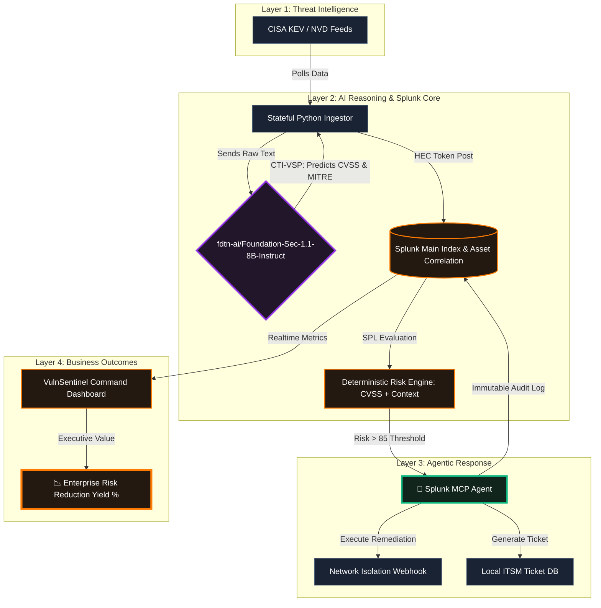
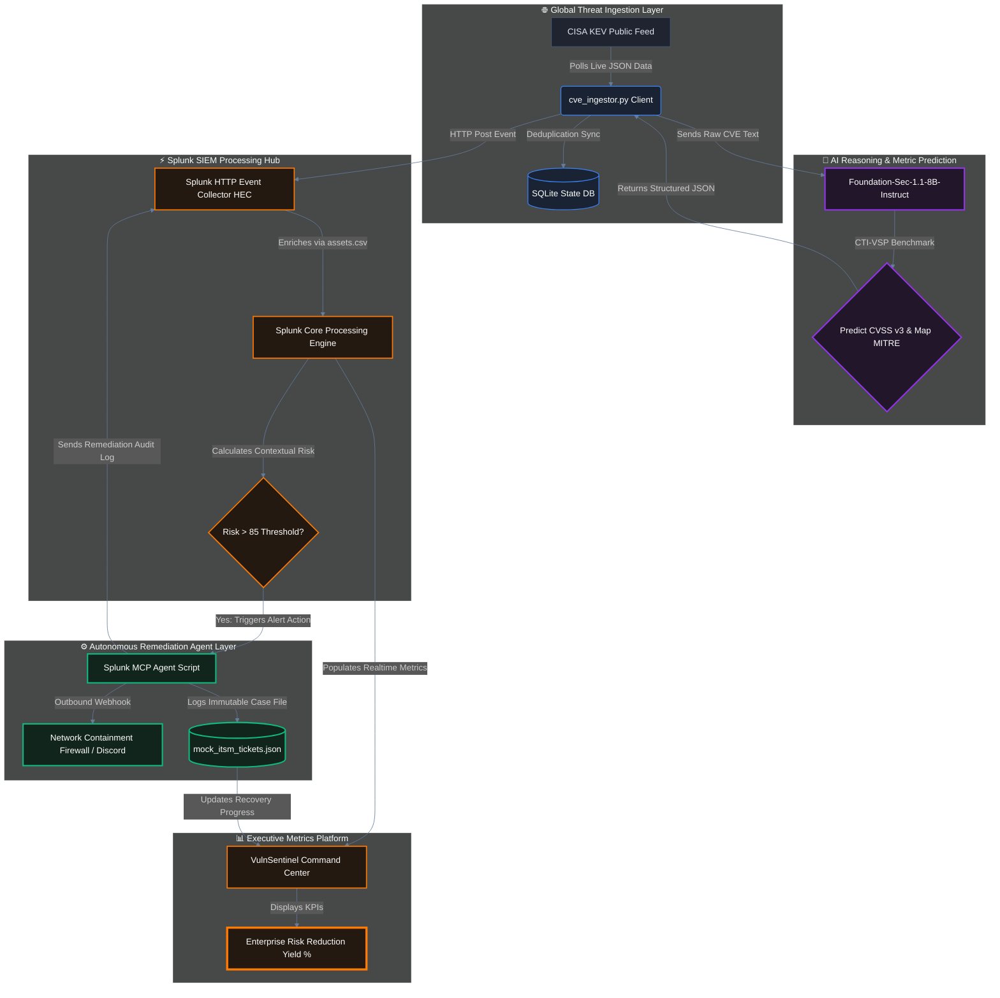

# 🗺️ VulnSentinel System Architecture Diagram

### 1. Diagram 1: The Refined Technical View 

### 2. Diagram 2: The Detailed closed-loop View 

This diagram maps out the closed-loop, data-driven agentic lifecycle of VulnSentinel. It displays the entire cycle from edge data discovery down to autonomous network isolation and dashboard business updates.

