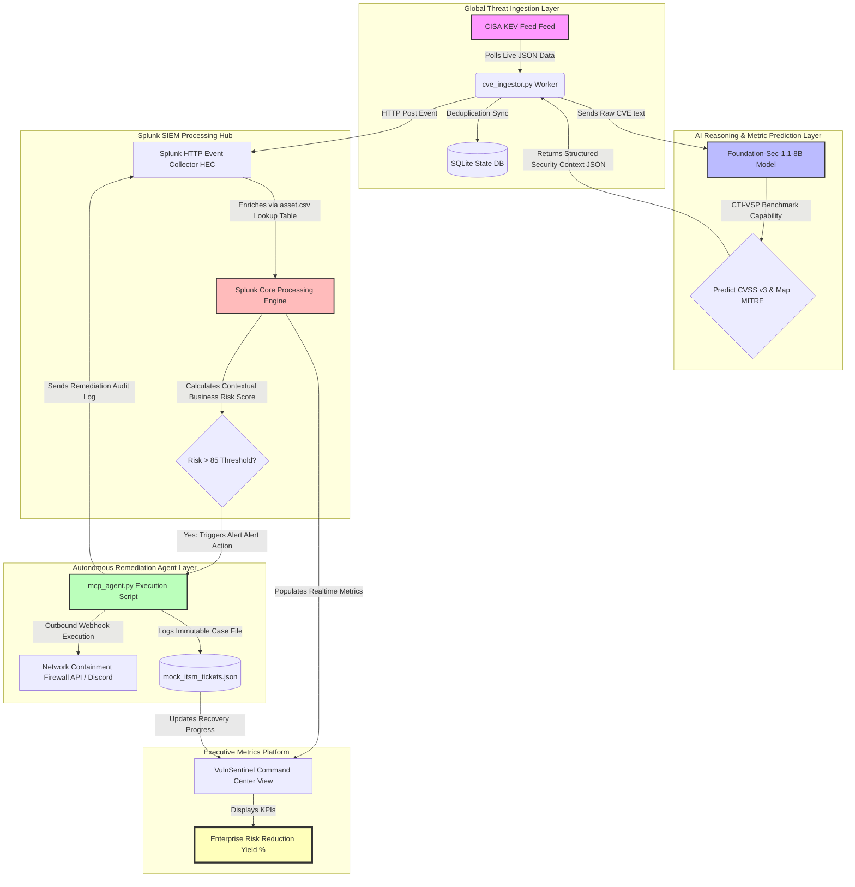

# 🗺️ VulnSentinel System Architecture Diagram

This diagram maps out the closed-loop, data-driven agentic lifecycle of VulnSentinel. It displays the entire cycle from edge data discovery down to autonomous network isolation and dashboard business updates.

